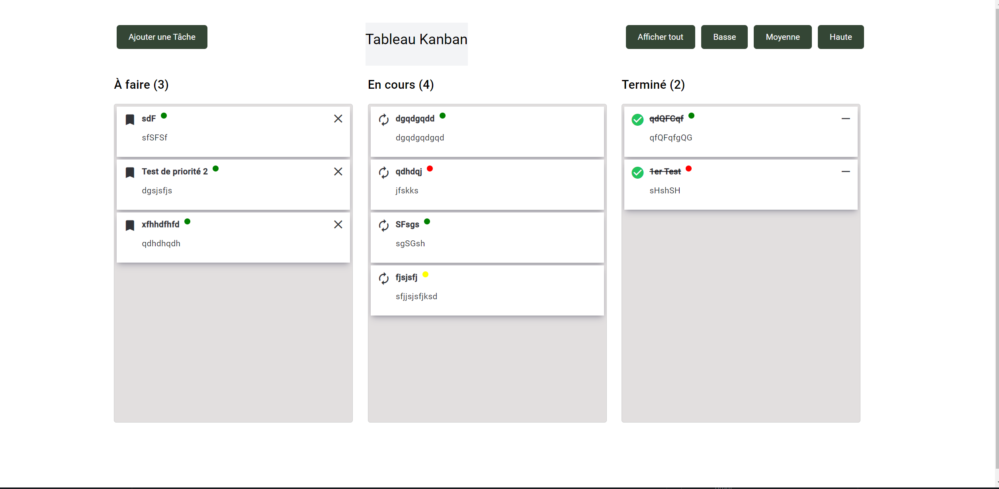

# Kanban Board App

## Description

Une application Kanban Board simple réalisée avec Angular 17 pour vous aider à gérer efficacement vos tâches et projets.

## Fonctionnalités

- Créez, lisez, mettez à jour et supprimez des tâches.
- Organisez vos tâches en colonnes "À faire", "En cours" et "Terminé".
- Déplacez les tâches d'une colonne à une autre en utilisant le glisser-déposer.
- Visualisez vos tâches avec un design propre et intuitif.

## Installation

Pour installer l'application localement, suivez ces étapes :

1. Clonez le dépôt GitHub sur votre machine locale :

git clone https://github.com/tchessi-pre/veille-techno-frontend.git

1. Accédez au répertoire de l'application :

cd kanban-board-app

1. Installez les dépendances nécessaires :

npm install

4. Démarrez l'application en mode développement :

ng serve ou ng serve -o

L'application sera accessible à l'adresse `http://localhost:4200/` dans votre navigateur.

## Utilisation

- Créez de nouvelles tâches en cliquant sur le bouton "Ajouter une tâche" dans la colonne "À faire".
- Déplacez les tâches d'une colonne à une autre en les faisant glisser et en les déposant à l'endroit souhaité.
- Cliquez sur une tâche pour la mettre à jour ou la supprimer.
- Organisez vos tâches comme bon vous semble.

## Contributions

Les contributions sont les bienvenues ! Si vous souhaitez contribuer à l'amélioration de cette application, veuillez suivre ces étapes :

1. ForkEz le dépôt (`https://github.com/votre-utilisateur/kanban-board-app/fork`)
2. Créez une branche pour votre fonctionnalité (`git checkout -b feature/ma-fonctionnalite`)
3. Commitez vos modifications (`git commit -am 'Ajout de ma fonctionnalité'`)
4. Pushez votre branche (`git push origin feature/ma-fonctionnalite`)
5. Ouvrez une demande de tirage (Pull Request) sur GitHub

## Licence

Ce projet est sous licence MIT. Consultez le fichier [LICENSE](LICENSE) pour plus de détails.

## Contact

Pour toute question ou commentaire, n'hésitez pas à me contacter à [tchessi.pre@laplateforme.io](mailto:votre@email.com).

